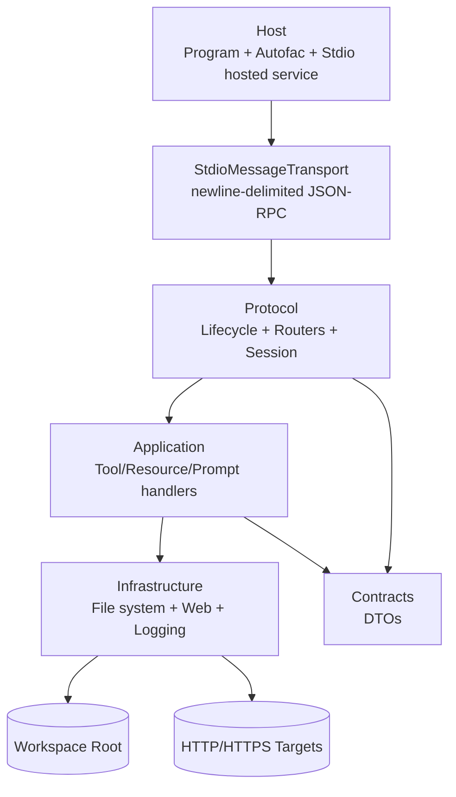

# Architecture

## Overview

McpServer is a layered .NET 10 Model Context Protocol server with a stdio transport.
The solution separates transport and protocol concerns from application behavior and infrastructure details.

The runtime is built around these responsibilities:

- `McpServer.Host`: process startup, configuration, dependency injection, stdio server loop.
- `McpServer.Protocol`: JSON-RPC/MCP protocol orchestration, lifecycle state, routing between MCP endpoints and application handlers.
- `McpServer.Application`: tool, resource, and prompt abstractions plus concrete handler implementations.
- `McpServer.Infrastructure`: file system, locking, path policy, web access, and logging implementations.
- `McpServer.Contracts`: DTOs exchanged over MCP/JSON-RPC.
- `McpServer.Domain`: placeholder domain layer for future business rules.

## Layering

## Project Responsibilities

| Project | Responsibility | Key Types |
| --- | --- | --- |
| `src/McpServer.Host` | Starts the process, wires dependencies, hosts the stdio request loop, configures Serilog and `HttpClient` instances. | `StdioServerHostedService`, `StdioMessageTransport`, `AutofacRootModule`, `McpServerOptions` |
| `src/McpServer.Protocol` | Owns MCP lifecycle, session state, JSON-RPC models, and routing for tools, resources, and prompts. | `McpSession`, `InitializeHandler`, `ShutdownHandler`, `ExitHandler`, `ToolCallRouter`, `ResourceReadRouter`, `PromptRouter` |
| `src/McpServer.Application` | Defines application-facing abstractions and concrete handlers for filesystem tools, command execution, resources, and prompts. | `IToolHandler<TRequest>`, `IResourceHandler`, `IPromptHandler`, filesystem tool handlers, `ShellExecToolHandler`, prompt handlers, resource handlers |
| `src/McpServer.Infrastructure` | Implements file access, path validation, per-path locking, process execution, web access, HTML extraction, and logging bootstrap. | `FileSystemService`, `PathPolicy`, `FileMutationLockProvider`, `ResourcePathTranslator`, `ProcessExecutionService`, `WebAccessService`, `WebPolicy`, `SerilogBootstrap` |
| `src/McpServer.Contracts` | Defines serialized DTOs and request/response contracts used over MCP/JSON-RPC. | lifecycle, tool, resource, prompt, and content DTO records |
| `src/McpServer.Domain` | Reserved for future domain entities or business rules. | `Placeholder` |
| `tests/*` | Unit and integration validation. | xUnit test suites and stdio integration harness |

## Runtime Flow

### 1. Process startup

`Program.cs` creates a generic host, configures Serilog, registers named `HttpClient` instances, and delegates Autofac registrations to `AutofacRootModule`.

### 2. Dependency injection

`AutofacRootModule` registers:

- lifecycle/session services as singletons
- routers as singletons
- filesystem services and policies
- process execution services
- all filesystem tool handlers
- the `shell.exec` tool handler
- all resource handlers
- all prompt handlers
- optional web policy, web access service, and web tool handlers when enabled in configuration

### 3. Transport loop

`StdioServerHostedService` opens stdin/stdout, creates `StdioMessageTransport`, resolves protocol services, and loops over newline-delimited JSON-RPC requests.

### 4. Request dispatch

Each request is dispatched by JSON-RPC method name:

- `initialize`
- `ping`
- `notifications/initialized`
- `shutdown`
- `exit`
- `tools/list`
- `tools/call`
- `resources/list`
- `resources/read`
- `prompts/list`
- `prompts/get`

### 5. Session gating

`McpSession` tracks:

- protocol version and client capabilities
- whether initialization completed
- whether the server is ready
- whether shutdown was requested

Most routed operations require `session.IsReady == true` before execution.

## Lifecycle Design

### Initialize

`InitializeHandler` negotiates the requested protocol version, updates `McpSession`, and returns advertised server capabilities from `CapabilityProvider`. Supported versions are preserved exactly, while unknown client versions fall back to `2025-03-26` for compatibility with current LM Studio builds.

### Ping

`StdioServerHostedService` handles `ping` directly and returns an empty result object so MCP hosts can perform lightweight health checks.

### Initialized notification

`StdioServerHostedService` maps `notifications/initialized` to `session.MarkReady()`.

### Shutdown

`ShutdownHandler` delegates to `session.RequestShutdown()`.

### Exit

`ExitHandler` logs the final state and decides whether the host should stop after receiving `exit`.

## Tool Execution Flow

Tool flow is:

1. `ToolCallRouter.RouteAsync` selects a handler by MCP tool name.
2. Incoming JSON arguments are deserialized into a contract request DTO.
3. A concrete application handler executes business logic and returns `Fin<CallToolResult>`.
4. The protocol layer maps application results to `CallToolResultDto`.

Filesystem tools are always available:

- `fs.write_text`
- `fs.append_text`
- `fs.create_directory`
- `fs.move_path`
- `fs.copy_path`
- `fs.delete_path`

The host also exposes:

- `shell.exec` for non-interactive command execution inside the validated workspace root

Web tools are optional and only registered when `McpServer:WebAccess:Enabled` is `true`:

- `web.fetch_url`
- `web.search`

## Resource Execution Flow

Resource flow is:

1. `ResourceReadRouter.RouteAsync` selects a resource handler by URI scheme.
2. A resource handler asks `IResourcePathTranslator` to translate MCP-style URIs to local paths.
3. The handler uses `IFileSystemService` to read file text, metadata, or directory listings.
4. The protocol layer maps `ReadResourceResult` to DTO content variants.

Supported resource schemes:

- `file://` for text content
- `dir://` for directory listings
- `filemeta://` for metadata

## Prompt Execution Flow

Prompt flow is:

1. `PromptRouter.GetAsync` selects a prompt handler by name.
2. Arguments are passed as `JsonElement?`.
3. The handler returns `Fin<GetPromptResult>`.
4. The protocol layer converts prompt messages into serialized prompt DTOs.

Built-in prompts:

- `prompt.summarize_file`
- `prompt.review_directory`

## File System Design

The filesystem implementation in `FileSystemService` is intentionally policy-driven.

### Path validation

`PathPolicy` normalizes all paths and rejects anything outside configured allowed roots. For MCP-facing paths it treats both `/workspace/...` and `/mcpserver-filesystem/...` as the same virtual workspace root so LM Studio can pass its server alias without breaking file or command tools.

### URI translation

`ResourcePathTranslator` accepts `file`, `dir`, and `filemeta` schemes and converts them to local paths.

### Process execution

`ProcessExecutionService` runs non-interactive commands with validated working directories, captured stdout/stderr, bounded output, and timeout enforcement. This keeps `shell.exec` workspace-scoped and predictable for MCP hosts.

### Concurrency control

`FileMutationLockProvider` provides per-path async locks for write, append, move, copy, delete, and multi-path operations.

### File operations

`FileSystemService` exposes:

- file text reads
- directory enumeration
- metadata reads
- write/append operations
- directory creation
- move/copy/delete operations

All operations return `LanguageExt.Fin<T>` so failures stay explicit across layer boundaries.

## Web Access Design

Web access is optional and isolated behind abstractions.

- `WebPolicy` validates URLs and host allowlists.
- `WebAccessService` uses named `HttpClient` instances.
- `HtmlTextExtractor` extracts readable text, title, and links from HTML.

The host preconfigures the `web-access` and `web-search` clients with decompression and redirect settings.

## Contracts Strategy

`McpServer.Contracts` contains only records and small helpers used for serialization.
This keeps the wire format independent from application/infrastructure internals.

The main contract groups are:

- lifecycle DTOs
- tool DTOs and tool request payloads
- resource DTOs
- prompt DTOs and prompt argument payloads
- shared content DTOs

## Error Handling Strategy

The solution consistently uses `LanguageExt.Fin<T>` for non-exceptional failures.

- application and infrastructure services return `Fin<T>`
- protocol handlers and routers convert failures into JSON-RPC/MCP error responses
- transport only handles serialization, framing, and dispatch-level exception boundaries

## Test Strategy

`tests/McpServer.UnitTests` validates focused behavior such as:

- lifecycle handling
- router behavior
- stdio framing
- `shell.exec` result mapping
- path comparison semantics
- web tool result mapping

`tests/McpServer.IntegrationTests` validates end-to-end stdio startup, initialization shape, unrelated working-directory launches, ping handling, JSON-RPC response shape, and `shell.exec` execution against the host project.

## Extension Points

The most important extension seams are:

- add new tools by implementing `IToolHandler<TRequest>` and registering the handler in Autofac plus `ToolCallRouter`
- add new resources by implementing `IResourceHandler` and registering the handler in Autofac
- add new prompts by implementing `IPromptHandler` and registering the handler in Autofac
- add new infrastructure services behind application abstractions instead of coupling protocol or host layers to concrete implementations
